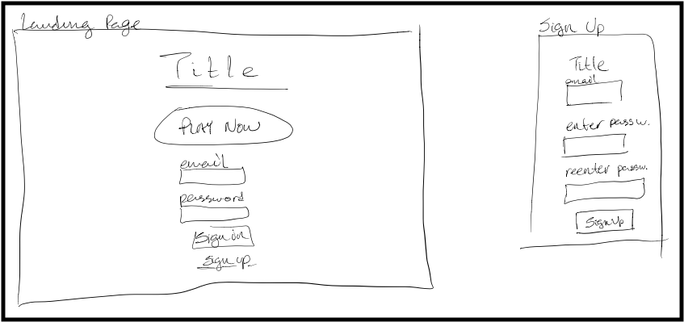
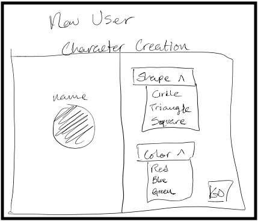
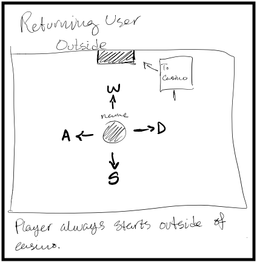
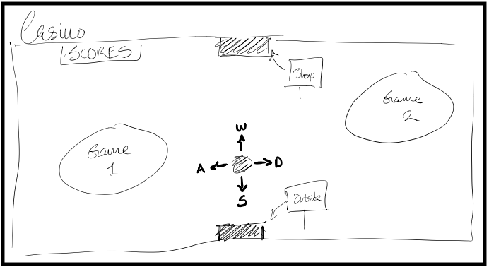
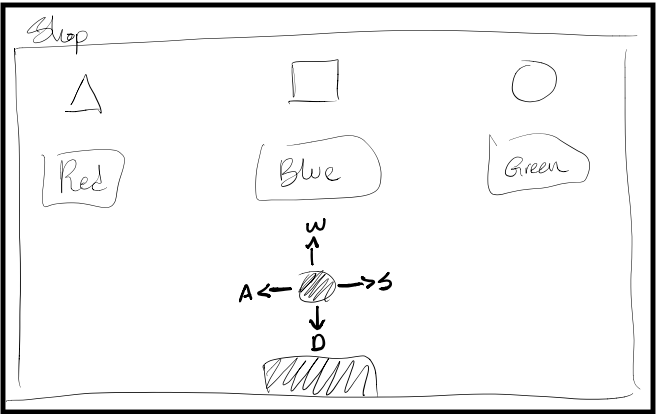
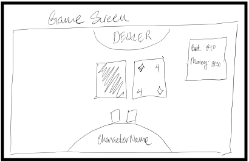
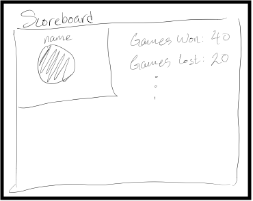

# Milestone 2

In this document, we've only listed the *core* requirements for our project. We specify our stretch goals in the milestone 1 document.

## Project Features List & Functional Requirements

### 1: User is able to sign up and sign in.

If the user doesn't have an account, they can make one. If they have one, they can sign in. They can sign out.

### 2: User is able to create a character.

The user will be able to choose a shape and color for their character. They will be able to name their character.

### 3: User is able to move their character around.

The user will be able to move their character using the arrow keys.

### 4: User is able to play two casino games.

The user is able to enter a minigame environment where they play a casino game.

### 5: The user's score and other data is kept.

The user should be able to see their score and access data about the games they've played. That is, they should be able to see how many games they've won/lost.

### 6: User is able to earn points and spend them at a store to customize their character.

User should be able to spend their points to change the color or shape of their character.

## Non-Functional Requirements

### 1: User is able to sign up and sign in.

* Front
  * HTML/CSS for the input forms.
  * JavaScript for getting data, if necessary.
* Middle
  * Django for getting/sending data to database.
* Back
  * MySQL for the database management system.

### 2: User is able to create a character.

* Front
  * HTML/CSS for images and dropdown menus.
  * JavaScript for getting data, if necessary.
* Middle
  * Django for getting/sending data to the database.
* Back
  * MySQL for the database management system.

### 3: User is able to move their character around.

* Front
  * HTML/CSS for images and text.
  * JavaScript for getting/sending data if necessary.
* Middle
  * Django for getting/sending data to the database.
* Back
  * MySQL for the database management system.

### 4: User is able to play two casino games.

* Front
  * HTML/CSS for images and text.
  * JavaScript for getting/sending data if necessary.
* Middle
  * Django for getting/sending data to the database.
* Back
  * MySQL for the database management system.

### 5: The user's score and other data is kept.

* Front
  * HTML/CSS for displaying score and other data.
  * JavaScript for getting/sending data if necessary.
* Middle
  * Django for getting/sending data to the database.
* Back
  * MySQL for the database management system.

### 6: User is able to earn points and spend them at a store to customize their character.

* Front
  * HTML/CSS for changing shape and color.
  * JavaScript for getting/sending data if necessary.
* Middle
  * Django for getting/sending data to the database.
* Back
  * MySQL for the database management system.

## Wireframes and User Stories

### 1: User is able to sign up and sign in.

* What is the feature?
  * Sign in / sign up page.
* Who will benefit?
  * Those who are want to sign in / sign up to save their data.
* Why are we making it?
  * So that users can save their data. This, in theory, lowers the barrier for the user to play the game again because they know their data will be saved.
* When will it be done?
  * Front = 2/20
  * Middle = 3/26
  * Back = 3/5
* Acceptance Criteria:
  * User ID, email, and password are securely stored in the database.
  * User is able sign out and sign in.
  * User's data is saved.

### 2: User is able to create a character.

* What is the feature?
  * Character creation page.
* Who will benefit?
  * People who want to create a custom character.
* Why are we making it?
  * So that our game is more interesting and interactive.
* When will it be done?
  * Front = 2/20
  * Middle = 3/26
  * Back = 3/5
* Acceptance Criteria:
  * User is able to modify their character's shape and color.

### 3: User is able to move their character around.

* What is the feature?
  * Being able to move the character with WASD or arrow keys.
* Who will benefit?
  * The user is going to benefit from being able to move their character around.
* Why are we making it?
  * So that the game is more realistic and interactive.
* When will it be done?
  * Front = 2/20
  * Middle = 2/27
* Acceptance Criteria:
  * User is able to move their character around without any bugs.

### 4: User is able to play two casino games.

* What is the feature?
  * Playing the games.
* Who will benefit?
  * Users who like games.
* Why are we making it?
  * It's the core feature of the app.
* When will it be done?
  * Front = 2/20
  * Middle = 3/26
  * Back = 3/5
* Acceptance Criteria:
  * Both of the games are able to played.
  * No bugs.
  * Able to see the score in-game.

### 5: The user's data is kept.

* What is the feature?
  * Data management.
* Who will benefit?
  * The user will be able to keep their data.
* Why are we making it?
  * It makes the game more fun.
* When will it be done?
  * Middle = 3/26
  * Back = 3/5
* Acceptance Criteria:
  * When the user signs back in, every bit of data that was stored is kept.

### 6: User is able to earn points and spend them at a store to customize their character.

* What is the feature?
  * A store where you can customize your character.
* Who will benefit?
  * Users who like to customize their character.
* Why are we making it?
  * To make the game more interactive and realistic.
* When will it be done?
  * Front = 2/20
  * Middle = 3/26
  * Back = 3/5
* Acceptance Criteria:
  * Able to change shape and color of character.

## Project Plan

### Order in which things need to be done for the project to work as a whole...

1. Front end.
2. Movement.
3. Make database.
4. Implement game logic.
5. Connect "Users" table to front end. The "Users" table contains the "User Items", "User Display", and "User Stats" tables.
6. Other items that we haven't listed here. Testing, logistics of publishing the website, etc.

[Kanban Board for Front End](https://github.com/csci-3308-6/code/projects/1)

[Kanban Board for Middle Layer](https://github.com/csci-3308-6/code/projects/2)

[Kanban Board for Back End](https://github.com/csci-3308-6/code/projects/3)

Front end, database, and game logic can be worked on at any time.

| Feature | Sprint Duration | Responsible Developers  |
|---------|-----------------|-------------------------|
| 1       | 2/16-2/20       | Liam, Ted               |
| 2       | 2/20-2/27       | Brian, Liam             |
| 3       | 2/27-3/5        | Brehn, Charles, Natalie |
| 4       | 3/5-3/12        | Brian, Liam, Ted        |
| 5       | 3/12-3/26       | Brehn, Charles, Natalie |
| 6       | 3/26-4/9        | Everyone                |

