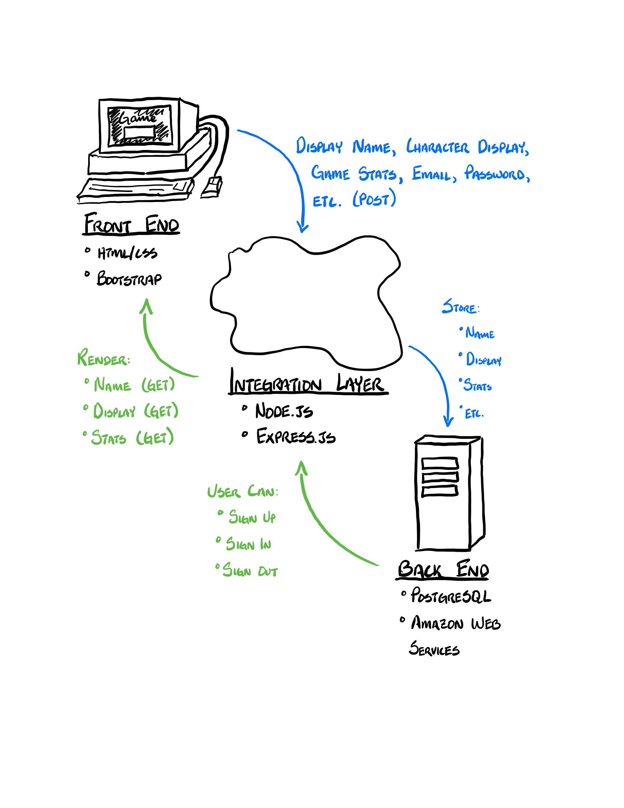
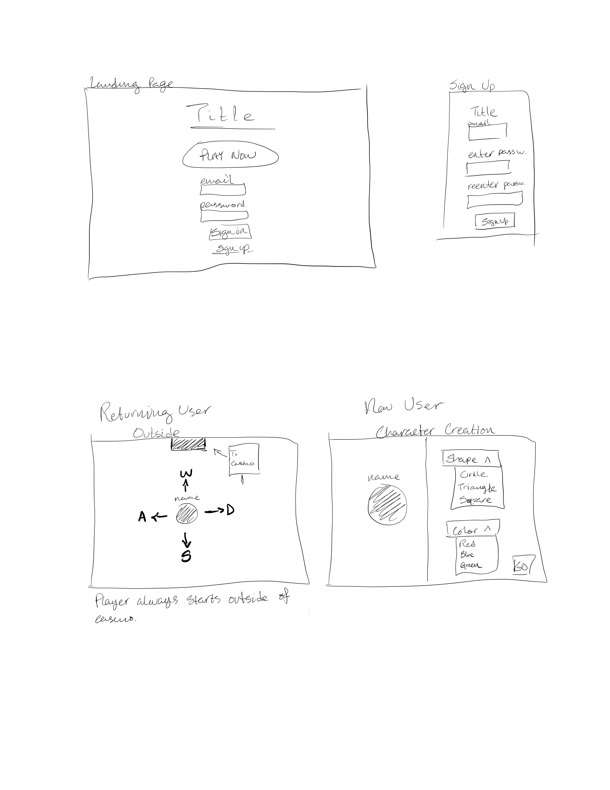
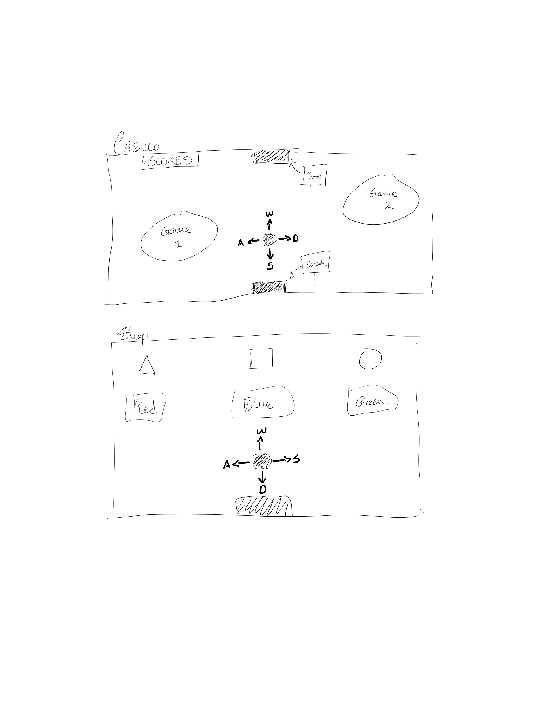
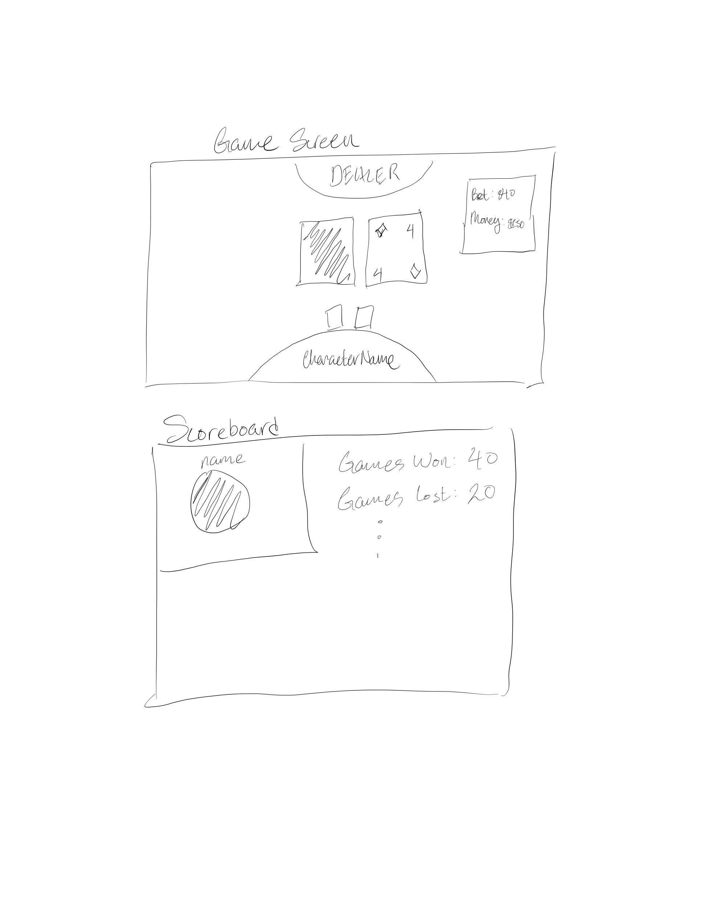
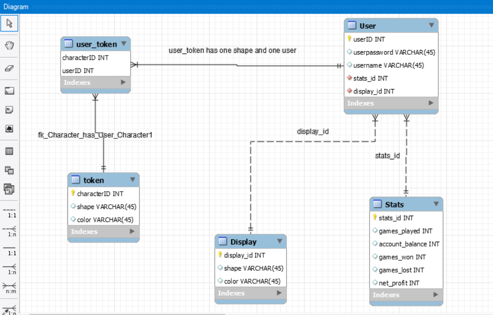

# Project Milestone 4

## Revised List of Features

### 1: User is able to sign up and sign in.

If the user doesn't have an account, they can make one. If they have one, they can sign in. They can sign out. (No change.)

### 2: User is able to create a character.

The user will be able to choose a shape and color for their character. They will be able to name their character. (No change.)

### 3: User is able to move their character around.

The user will be able to move their character using the ~~arrow keys~~ WASD keys.

### 4: User is able to play two ~~casino~~ games.

The user is able to enter a minigame environment where they play a ~~casino~~ game.

### 5: The user's score and other data is kept.

The user should be able to see their score and access data about the games they've played. That is, they should be able to see how many games they've won/lost. (No change.)

### 6: User is able to earn points and spend them ~~at a store~~ to customize their character.

User should be able to spend their points to change the color or shape of their character.

## Architecture Diagram

## Front End Design

These wireframes are old, but they convey the front end design well enough.

## Web Service Design

We intend to use Amazon Web Services. Specifically, we'd like to use AWS Elastic Beanstalk.

**Description From AWS Website:**

> With AWS Elastic Beanstalk, you can quickly deploy and manage applications in the AWS Cloud without worrying about the infrastructure that runs those applications. AWS Elastic Beanstalk reduces management complexity without restricting choice or control. You simply upload your application, and AWS Elastic Beanstalk automatically handles the details of capacity provisioning, load balancing, scaling, and application health monitoring.

From what we understand, all of our data will reside on AWS servers. The data will be passed from the browser to AWS and vice versa.

## Database Design

We intend to use PostgreSQL for our database management system.

