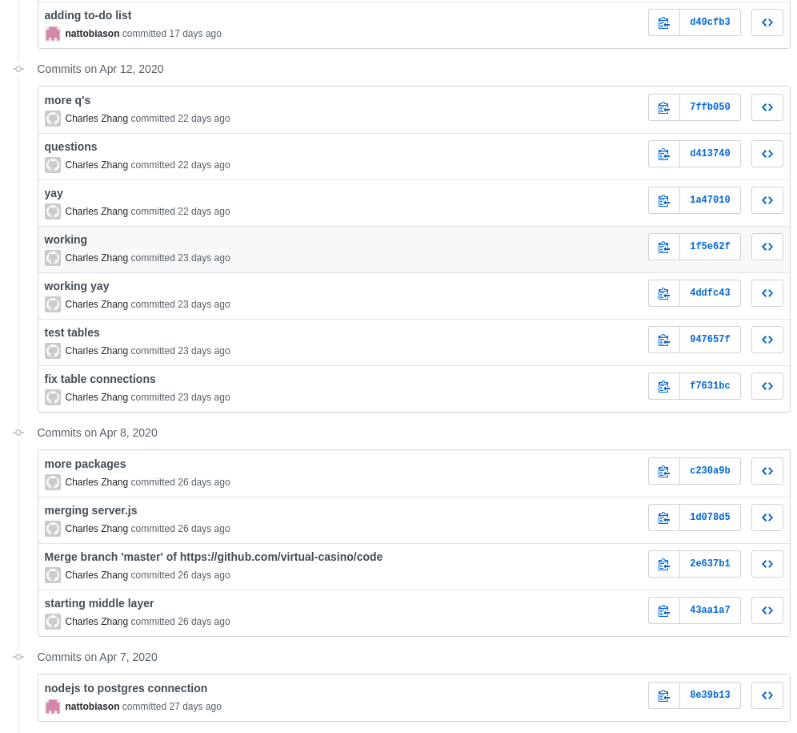
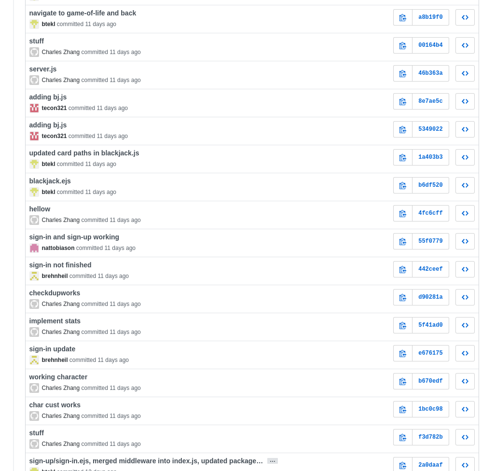

# Retr.io Games

## Team Members

Ted Conklin, Brehn Heil, Liam Mulhall, Brian Teklits, Natalie Tobiason, and Charles Zhang

## Description

Retr.io Games is an arcade room with games including Blackjack and Game of Life. The user is first brought to the home screen where they have the option to sign in or sign up. If the user has not made an account, they sign up with a unique email and password. The user then customizes their display name and their character icon’s shape and color. Emails, passwords, display info, and user game statistics are all kept in the database and accessed by the users unique email ID. If a user already has an account, they sign in and are brought to the main game room. The game room includes the user’s character icon that can move around the game room by using arrow keys and walking up to the game tables. Once a user has approached a game table, they are brought to a page that allows them to play that game. User’s Blackjack statistics are kept in the database and are viewable to the user when they press the stats button. The user is free to switch between games in the game room, and sign out / sign in when they want to play again.

## Tracker

[GitHub Kanban Boards](https://github.com/retrio-games/code/projects)

## VCS

[Retr.io Games GitHub Page](https://github.com/retrio-games)

## Contributions

### Brehn Heil
 
I worked mainly on the integration layer. I helped with connecting the users table to the game. Created the sign in function as well as helped with sign up function. Also created the scoreboard menu.

### Brian Teklits

I worked on the front end and middle layer. I worked on the character creation and movement features, initially with the Phaser framework (not used in the final build) and later in standard JS. I also helped with middle layer integration (using database information in JS game logic) as well as deploying the site to Heroku.

### Liam Mulhall

Mostly front end. Made the home, sign in, sign up, and game room pages in HTML/CSS. Also implemented the movement for the game room. Added Game of Life to test functionality. Also coordinated meetings and submitted assignments.

### Natalie Tobiason

I worked on creating the database and integrating the database within the middle layer. I worked on creating the initial server that allowed us to access PostgreSQL, and using get/post functions and queries for the sign in, blackjack, and sign out pages. I also worked on keeping track of user stats within the blackjack javascript, and passing information from it to the database.

### Ted Conklin

I worked mostly on the front end. I created the functionality and HTML/CSS design of the blackjack game, and worked on our initial, simple versions of the sign in and sign up pages. I also set up our initial database diagram, which we adjusted as we went, and later assisted with the part of the middle layer that sends our in-game blackjack statistics to the scoreboard menu.

### Charles Zhang

I worked on the middle and back layer. I was involved in dealing with moving data to and from the database, and also did some work editing SQL tables. This also involved editing file paths for buttons and form tags in the ejs files to make everything link up correctly. I also did some work with UI elements in the ejs and JavaScript files, such as displaying certain statistics in the blackjack game. I worked on getting the sign up and character customization pages to work and put user data into the database. This involved writing queries and get/post requests. I also worked on fetching user data to display the right avatar in the game room.

For some reason my commits were not registered under my GitHub username (Infam) and instead under my real name. This seemed to be because I signed in to my Github using my username and not my email. For this reason I don’t have any statistics. However, I do have commits in both repositories that I have screenshotted below:

## Deployment
 
[Retr.io Games Website](https://retriogames.herokuapp.com/)
